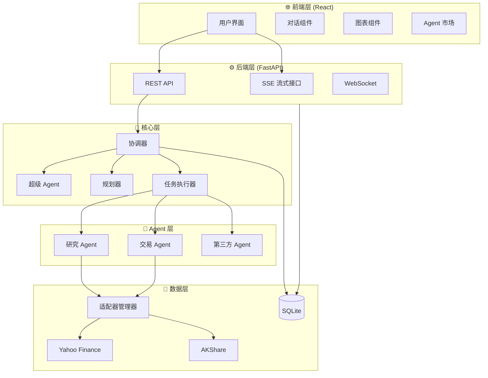
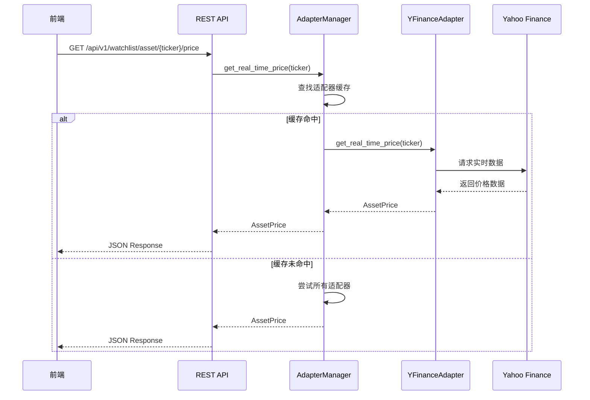
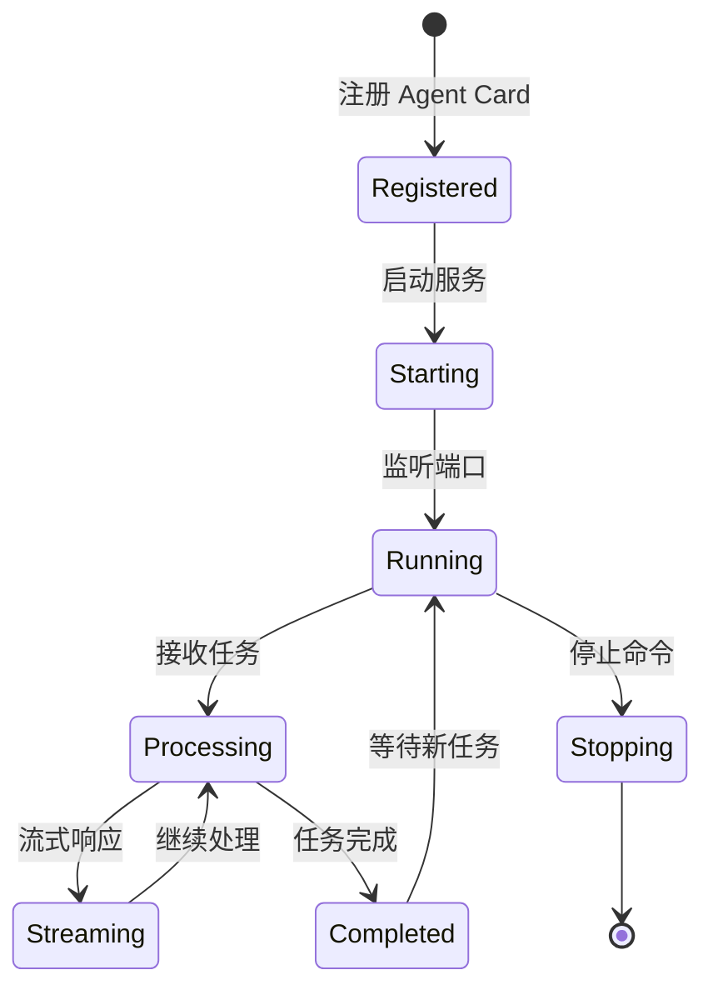
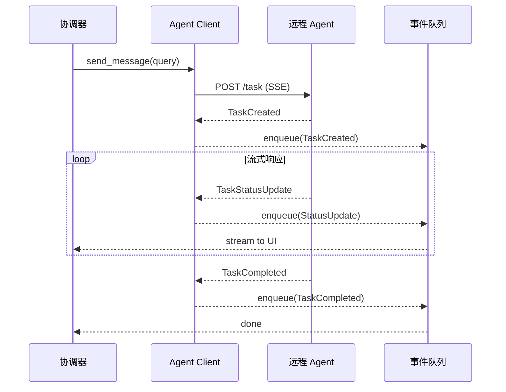
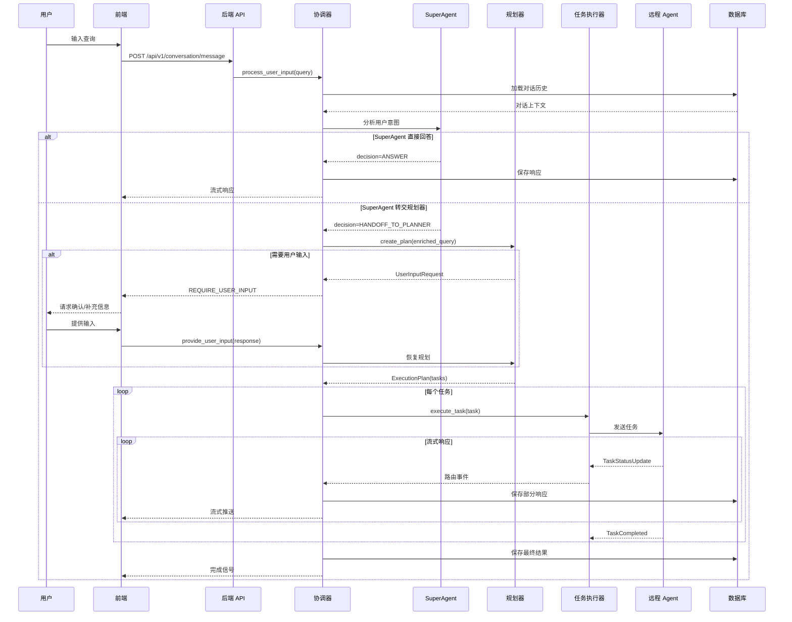
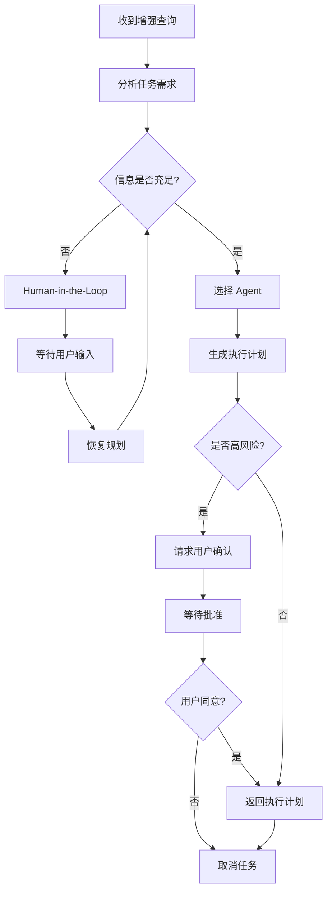
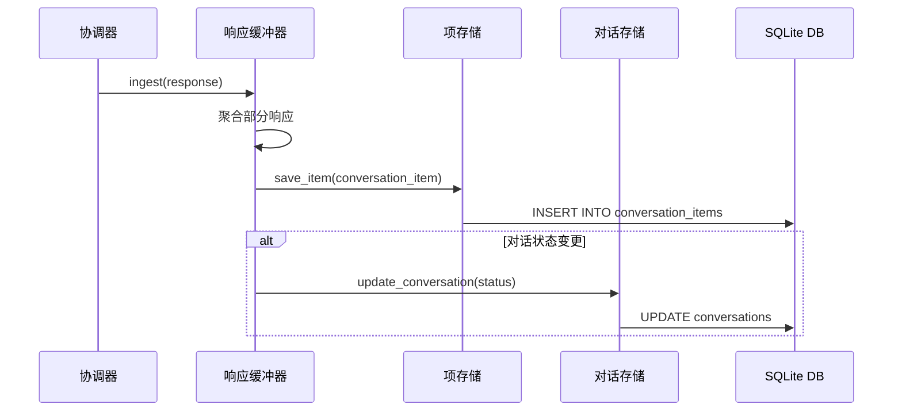
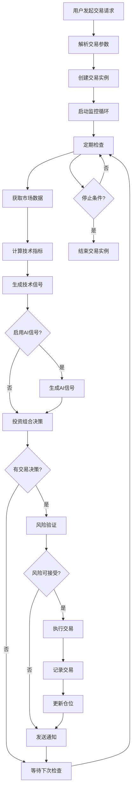

# ValueCell 详细功能与实现说明

> **版本**: 0.1.0  
> **日期**: 2025-10-29  
> **作者**: ValueCell Team

---

## 📋 目录

1. [项目概述](#1-项目概述)
2. [系统架构](#2-系统架构)
3. [数据获取与存储](#3-数据获取与存储)
4. [Agent 系统](#4-agent-系统)
5. [对话与反馈机制](#5-对话与反馈机制)
6. [交易与分析流程](#6-交易与分析流程)
7. [前端实现](#7-前端实现)
8. [API 接口](#8-api-接口)
9. [部署与运维](#9-部署与运维)

---

## 1. 项目概述

### 1.1 什么是 ValueCell？

ValueCell 是一个**社区驱动的多智能体金融应用平台**，专注于：

- 🤖 **多智能体协作**: 基于 A2A (Agent-to-Agent) 协议的分布式智能体系统
- 📊 **金融数据分析**: 支持美股、加密货币、A股、港股等多个市场
- 💱 **自动化交易**: AI 驱动的加密货币自动交易策略
- 🔍 **深度研究**: SEC 文件分析、新闻分析、情绪分析
- 💬 **对话式交互**: 流式响应、人机协同（HITL）

### 1.2 核心特性

| 特性 | 说明 |
|------|------|
| **异步架构** | 基于 Python asyncio 的全异步设计 |
| **流式响应** | 实时流式传输 Agent 响应 |
| **可重入编排器** | 支持暂停/恢复的对话流程 |
| **持久化** | SQLite 存储对话历史和状态 |
| **跨域支持** | 前后端分离，支持远程访问 |
| **多数据源** | Yahoo Finance、AKShare 等适配器 |

---

## 2. 系统架构

### 2.1 整体架构图



### 2.2 技术栈

#### 后端
- **Python 3.12+** - 核心语言
- **FastAPI** - Web 框架
- **uvicorn** - ASGI 服务器
- **SQLite** - 数据库
- **aiosqlite** - 异步 SQLite
- **a2a-sdk** - Agent 间通信协议
- **agno** - Agent 框架
- **OpenAI/Anthropic** - LLM 提供商

#### 前端
- **React 19** - UI 框架
- **React Router 7** - 路由
- **TypeScript** - 类型安全
- **Tailwind CSS 4** - 样式
- **Vite 7** - 构建工具
- **Bun** - 运行时和包管理器
- **ECharts** - 图表库

#### 数据源
- **yfinance** - Yahoo Finance API
- **akshare** - A股/港股数据
- **Edgar Tools** - SEC 文件
- **Binance API** - 加密货币交易

---

## 3. 数据获取与存储

### 3.1 数据适配器架构

ValueCell 使用**适配器模式**统一管理多个数据源。

#### 3.1.1 核心组件

```
valuecell/adapters/assets/
├── base.py              # 基础适配器接口
├── manager.py           # 适配器管理器
├── yfinance_adapter.py  # Yahoo Finance 适配器
├── akshare_adapter.py   # AKShare 适配器
└── types.py             # 数据类型定义
```

#### 3.1.2 适配器接口

```python
class BaseDataAdapter(ABC):
    """所有数据适配器的基类"""
    
    @abstractmethod
    def get_asset_info(self, ticker: str) -> Optional[Asset]:
        """获取资产基本信息"""
        pass
    
    @abstractmethod
    def get_real_time_price(self, ticker: str) -> Optional[AssetPrice]:
        """获取实时价格"""
        pass
    
    @abstractmethod
    def get_historical_prices(
        self, ticker: str, start_date: datetime, end_date: datetime, interval: str
    ) -> List[AssetPrice]:
        """获取历史价格"""
        pass
    
    @abstractmethod
    def search_assets(self, query: str) -> List[AssetSearchResult]:
        """搜索资产"""
        pass
```

### 3.2 数据获取流程

#### 3.2.1 实时价格获取



#### 3.2.2 历史数据获取

**实现位置**: `python/valuecell/adapters/assets/yfinance_adapter.py`

```python
def get_historical_prices(
    self, ticker: str, start_date: datetime, end_date: datetime, interval: str = "1d"
) -> List[AssetPrice]:
    """获取历史价格数据"""
    source_ticker = self.convert_to_source_ticker(ticker)
    ticker_obj = yf.Ticker(source_ticker)
    
    # 获取历史数据
    hist = ticker_obj.history(start=start_date, end=end_date, interval=interval)
    
    prices = []
    for timestamp, row in hist.iterrows():
        price = AssetPrice(
            ticker=ticker,
            price=Decimal(str(row["Close"])),
            timestamp=timestamp.to_pydatetime(),
            open_price=Decimal(str(row["Open"])),
            high_price=Decimal(str(row["High"])),
            low_price=Decimal(str(row["Low"])),
            close_price=Decimal(str(row["Close"])),
            volume=Decimal(str(row["Volume"])),
            source=self.source,
        )
        prices.append(price)
    
    return prices
```

### 3.3 数据存储

#### 3.3.1 数据库架构

ValueCell 使用 **SQLite** 存储所有数据。

**数据库文件**: `/opt/valuecell/valuecell.db`

#### 3.3.2 表结构

```sql
-- 对话表
CREATE TABLE conversations (
    conversation_id TEXT PRIMARY KEY,
    user_id TEXT NOT NULL,
    title TEXT,
    agent_name TEXT,
    created_at TEXT NOT NULL,
    updated_at TEXT NOT NULL,
    status TEXT NOT NULL DEFAULT 'active'
);

-- 对话项表
CREATE TABLE conversation_items (
    item_id TEXT PRIMARY KEY,
    conversation_id TEXT NOT NULL,
    role TEXT NOT NULL,
    content TEXT,
    metadata TEXT,
    created_at TEXT NOT NULL,
    FOREIGN KEY (conversation_id) REFERENCES conversations(conversation_id)
);

-- Agent 表
CREATE TABLE agents (
    agent_id TEXT PRIMARY KEY,
    name TEXT NOT NULL UNIQUE,
    display_name TEXT NOT NULL,
    description TEXT,
    category TEXT,
    tags TEXT,
    url TEXT,
    enabled INTEGER DEFAULT 1,
    push_notifications INTEGER DEFAULT 0,
    created_at TEXT NOT NULL,
    updated_at TEXT NOT NULL
);

-- 资产表
CREATE TABLE assets (
    asset_id TEXT PRIMARY KEY,
    ticker TEXT NOT NULL UNIQUE,
    name TEXT NOT NULL,
    type TEXT NOT NULL,
    exchange TEXT,
    currency TEXT DEFAULT 'USD',
    created_at TEXT NOT NULL,
    updated_at TEXT NOT NULL
);

-- 关注列表表
CREATE TABLE watchlists (
    watchlist_id TEXT PRIMARY KEY,
    user_id TEXT NOT NULL,
    name TEXT NOT NULL,
    description TEXT,
    created_at TEXT NOT NULL,
    updated_at TEXT NOT NULL
);

-- 关注列表项表
CREATE TABLE watchlist_items (
    item_id TEXT PRIMARY KEY,
    watchlist_id TEXT NOT NULL,
    asset_id TEXT NOT NULL,
    notes TEXT,
    created_at TEXT NOT NULL,
    FOREIGN KEY (watchlist_id) REFERENCES watchlists(watchlist_id),
    FOREIGN KEY (asset_id) REFERENCES assets(asset_id)
);
```

#### 3.3.3 数据访问层

**Repository 模式**

```
valuecell/server/db/repositories/
├── agent_repository.py      # Agent 数据访问
├── conversation_repository.py  # 对话数据访问
├── asset_repository.py      # 资产数据访问
└── watchlist_repository.py  # 关注列表数据访问
```

**示例**: Agent Repository

```python
class AgentRepository:
    def __init__(self, db: DatabaseManager):
        self.db = db
    
    async def get_all(self, enabled_only: bool = False) -> List[Agent]:
        """获取所有 Agent"""
        query = "SELECT * FROM agents"
        if enabled_only:
            query += " WHERE enabled = 1"
        query += " ORDER BY created_at DESC"
        
        rows = await self.db.fetch_all(query)
        return [Agent.from_db_row(row) for row in rows]
    
    async def get_by_name(self, name: str) -> Optional[Agent]:
        """根据名称获取 Agent"""
        query = "SELECT * FROM agents WHERE name = ?"
        row = await self.db.fetch_one(query, (name,))
        return Agent.from_db_row(row) if row else None
```


---

## 4. Agent 系统

### 4.1 Agent 架构

ValueCell 使用 **Agent2Agent (A2A) 协议** 实现智能体间的通信。

#### 4.1.1 Agent 类型

| Agent 类型 | 说明 | 端口 | 实现 |
|-----------|------|------|------|
| **ResearchAgent** | 深度研究 Agent，分析 SEC 文件 | 10004 | `python/valuecell/agents/research_agent/` |
| **AutoTradingAgent** | 自动交易 Agent，加密货币交易 | 10003 | `python/valuecell/agents/auto_trading_agent/` |
| **TradingAgents** | 第三方交易 Agent 集合 | 10002 | `third_party/TradingAgents/` |
| **AI-Hedge-Fund** | 对冲基金 Agent 集合 | 10000+ | `third_party/ai-hedge-fund/` |

#### 4.1.2 Agent 生命周期



### 4.2 Agent Card 配置

#### 4.2.1 配置文件结构

**位置**: `python/configs/agent_cards/`

**示例**: `research_agent.json`

```json
{
  "name": "ResearchAgent",
  "url": "http://localhost:10004/",
  "enabled": true,
  "display_name": "深度研究 Agent",
  "description": "获取并分析股票的 SEC 文件",
  "category": "research",
  "tags": ["research", "sec", "analysis"],
  "push_notifications": false
}
```

#### 4.2.2 Agent Card 加载流程

```python
# python/valuecell/core/agent/connect.py

class RemoteConnections:
    def _load_remote_contexts(self, agent_card_dir: str = None):
        """从配置目录加载所有 Agent Card"""
        if agent_card_dir is None:
            agent_card_dir = Path(__file__).parent.parent.parent / "configs/agent_cards"
        
        for json_file in agent_card_dir.glob("*.json"):
            with open(json_file, "r") as f:
                card_dict = json.load(f)
            
            # 解析 Agent Card
            agent_card = parse_local_agent_card_dict(card_dict)
            if not agent_card:
                continue
            
            # 创建上下文
            ctx = AgentContext(
                name=agent_card.name,
                url=agent_card.url,
                local_agent_card=agent_card,
            )
            self._contexts[agent_card.name] = ctx
```

### 4.3 Agent 通信协议

#### 4.3.1 A2A 协议

**核心概念**:
- **AgentCard**: Agent 能力描述
- **Message**: 消息格式
- **TaskStatusUpdateEvent**: 任务状态更新事件
- **StreamResponse**: 流式响应

#### 4.3.2 消息流程



### 4.4 Agent 实现详解

#### 4.4.1 ResearchAgent

**功能**: 深度研究分析，支持 SEC 文件分析、网页搜索

**实现位置**: `python/valuecell/agents/research_agent/`

**核心代码**:

```python
class ResearchAgent(BaseAgent):
    def __init__(self, **kwargs):
        super().__init__(**kwargs)
        tools = [
            fetch_periodic_sec_filings,  # 定期报告
            fetch_event_sec_filings,     # 事件报告
            fetch_ashare_filings,        # A股公告
            web_search,                  # 网页搜索
        ]
        self.knowledge_research_agent = Agent(
            model=get_model("RESEARCH_AGENT_MODEL_ID"),
            instructions=[KNOWLEDGE_AGENT_INSTRUCTION],
            expected_output=KNOWLEDGE_AGENT_EXPECTED_OUTPUT,
            tools=tools,
            knowledge=knowledge,
            search_knowledge=True,
            add_history_to_context=True,
        )
    
    async def stream(
        self, query: str, conversation_id: str, task_id: str, dependencies: Optional[Dict] = None
    ) -> AsyncGenerator[StreamResponse, None]:
        """流式处理用户查询"""
        response_stream = self.knowledge_research_agent.arun(
            query, stream=True, stream_intermediate_steps=True, session_id=conversation_id
        )
        async for event in response_stream:
            if event.event == "RunContent":
                yield streaming.message_chunk(event.content)
            elif event.event == "ToolCallStarted":
                yield streaming.tool_call_started(event.tool.tool_call_id, event.tool.tool_name)
            elif event.event == "ToolCallCompleted":
                yield streaming.tool_call_completed(
                    event.tool.result, event.tool.tool_call_id, event.tool.tool_name
                )
        yield streaming.done()
```

**工具实现**:

```python
async def fetch_periodic_sec_filings(ticker: str, form_type: str = "10-K") -> str:
    """获取 SEC 定期报告"""
    company = Company(ticker)
    filings = company.get_filings(form=form_type).latest(1)
    if filings:
        filing = filings[0]
        return f"Filing Date: {filing.filing_date}\n\nContent:\n{filing.text()[:5000]}"
    return f"No {form_type} filings found for {ticker}"
```

#### 4.4.2 AutoTradingAgent

**功能**: 加密货币自动交易，技术分析、AI 信号生成、仓位管理

**实现位置**: `python/valuecell/agents/auto_trading_agent/`

**架构**:

```
auto_trading_agent/
├── agent.py                   # 主 Agent 逻辑
├── models.py                  # 数据模型
├── position_manager.py        # 仓位管理
├── market_data.py            # 市场数据获取
├── trade_recorder.py         # 交易记录
├── trading_executor.py       # 交易执行
├── technical_analysis.py     # 技术分析
├── portfolio_decision_manager.py  # 投资组合决策
├── formatters.py             # 消息格式化
└── exchanges/                # 交易所适配器
    ├── base_exchange.py      # 基础接口
    ├── binance_exchange.py   # Binance 实现
    └── paper_trading.py      # 模拟交易
```

**核心逻辑**:

```python
class AutoTradingAgent(BaseAgent):
    async def _process_trading_instance(
        self, session_id: str, instance_id: str, semaphore: asyncio.Semaphore
    ) -> None:
        """处理单个交易实例"""
        # Phase 1: 分析所有资产
        portfolio_manager = PortfolioDecisionManager(config, llm_client)
        
        for symbol in config.crypto_symbols:
            # 1. 计算技术指标
            indicators = TechnicalAnalyzer.calculate_indicators(symbol)
            
            # 2. 生成技术信号
            technical_action, technical_trade_type = TechnicalAnalyzer.generate_signal(indicators)
            
            # 3. 生成 AI 信号（可选）
            if ai_signal_generator:
                ai_signal = await ai_signal_generator.get_signal(indicators)
            
            # 4. 添加到投资组合分析
            asset_analysis = AssetAnalysis(
                symbol=symbol,
                indicators=indicators,
                technical_action=technical_action,
                ai_action=ai_action,
            )
            portfolio_manager.add_asset_analysis(asset_analysis)
        
        # Phase 2: 生成投资组合决策
        portfolio_decision = await portfolio_manager.make_portfolio_decision()
        
        # Phase 3: 执行交易
        if portfolio_decision.actions:
            for action in portfolio_decision.actions:
                await executor.execute_trade(
                    symbol=action.symbol,
                    action=action.action,
                    trade_type=action.trade_type,
                    quantity=action.quantity,
                )
```

### 4.5 Agent 注册与启动

#### 4.5.1 使用装饰器

```python
from valuecell.core.agent.decorator import _serve
from a2a.types import AgentCard

@_serve(
    AgentCard(
        name="MyAgent",
        url="http://localhost:10005/",
        description="My custom agent",
    )
)
class MyAgent(BaseAgent):
    async def stream(self, query: str, conversation_id: str, task_id: str):
        # 实现流式响应
        yield streaming.message_chunk("Processing...")
        yield streaming.done()
```

#### 4.5.2 启动流程

```bash
# 方式1: 使用 launch.py 启动所有 Agent
cd /opt/valuecell/python
uv run scripts/launch.py

# 方式2: 单独启动 Agent
cd /opt/valuecell/python
uv run -m valuecell.agents.research_agent

# 方式3: 使用 start.sh 启动（包含前端）
cd /opt/valuecell
./start.sh
```


---

## 5. 对话与反馈机制

### 5.1 对话流程

#### 5.1.1 完整对话流程图



### 5.2 SuperAgent 分流机制

#### 5.2.1 SuperAgent 决策逻辑

**实现位置**: `python/valuecell/core/super_agent/core.py`

```python
class SuperAgentOutcome(BaseModel):
    """SuperAgent 决策结果"""
    decision: Literal["answer", "handoff_to_planner"]
    content: Optional[str] = None  # 如果 decision=answer，这里是答案
    enriched_query: Optional[str] = None  # 如果 decision=handoff，这里是增强后的查询
    reason: Optional[str] = None  # 决策理由

class SuperAgent:
    async def run(self, user_input: str, context: Optional[str] = None) -> SuperAgentOutcome:
        """分析用户输入并做出决策"""
        prompt = f"""
        分析以下用户输入，决定是直接回答还是需要规划器介入：
        
        用户输入: {user_input}
        上下文: {context}
        
        如果是简单查询（如问候、帮助请求），直接回答。
        如果是复杂任务（如分析、交易、研究），转交规划器并提供增强查询。
        """
        
        response = await self.llm_client.generate(prompt, output_schema=SuperAgentOutcome)
        return response
```

#### 5.2.2 决策示例

| 用户输入 | SuperAgent 决策 | 原因 |
|---------|----------------|------|
| "你好" | ANSWER | 简单问候 |
| "帮我分析特斯拉的股票" | HANDOFF_TO_PLANNER | 需要调用 ResearchAgent |
| "开始自动交易 BTC" | HANDOFF_TO_PLANNER | 需要调用 AutoTradingAgent |
| "我的投资组合表现如何？" | HANDOFF_TO_PLANNER | 需要查询数据库和计算 |

### 5.3 规划器 (Planner)

#### 5.3.1 规划流程



#### 5.3.2 执行计划数据结构

```python
class ExecutionPlan(BaseModel):
    """执行计划"""
    plan_id: str
    tasks: List[Task]
    metadata: Dict[str, Any]

class Task(BaseModel):
    """单个任务"""
    task_id: str
    agent_name: str  # 要调用的 Agent
    action: str  # 要执行的动作
    parameters: Dict[str, Any]  # 参数
    dependencies: List[str] = []  # 依赖的任务 ID
    priority: int = 0
```

#### 5.3.3 Human-in-the-Loop (HITL) 实现

```python
# python/valuecell/core/plan/planner.py

class UserInputRequest(BaseModel):
    """用户输入请求"""
    request_id: str
    prompt: str  # 向用户展示的提示
    input_type: Literal["text", "confirmation", "selection"]
    options: Optional[List[str]] = None  # 如果是 selection

class ExecutionPlanner:
    async def create_plan(
        self, 
        query: str, 
        context: Optional[str] = None
    ) -> Union[ExecutionPlan, UserInputRequest]:
        """创建执行计划，可能需要用户输入"""
        
        # 分析查询
        analysis = await self._analyze_query(query)
        
        # 检查是否缺少关键信息
        if analysis.missing_info:
            return UserInputRequest(
                request_id=generate_id(),
                prompt=f"为了完成任务，需要以下信息：{analysis.missing_info}",
                input_type="text",
            )
        
        # 检查是否高风险操作
        if analysis.is_high_risk:
            return UserInputRequest(
                request_id=generate_id(),
                prompt=f"即将执行高风险操作：{analysis.risk_description}。是否继续？",
                input_type="confirmation",
                options=["确认", "取消"],
            )
        
        # 生成执行计划
        plan = ExecutionPlan(
            plan_id=generate_id(),
            tasks=await self._generate_tasks(analysis),
        )
        return plan
```

### 5.4 任务执行与流式响应

#### 5.4.1 TaskExecutor 实现

```python
# python/valuecell/core/task/executor.py

class TaskExecutor:
    async def execute_task(
        self, 
        task: Task, 
        context: ExecutionContext
    ) -> AsyncGenerator[StreamResponse, None]:
        """执行单个任务并流式返回结果"""
        
        # 1. 获取 Agent Client
        agent_client = await self.remote_connections.start_agent(task.agent_name)
        
        # 2. 发送任务到远程 Agent
        async for event in agent_client.send_message_streaming(
            query=task.action,
            parameters=task.parameters,
            conversation_id=context.conversation_id,
            task_id=task.task_id,
        ):
            # 3. 路由事件到响应
            responses = await self.response_router.route_event(event)
            
            # 4. 缓冲和聚合响应
            for response in responses:
                annotated = await self.response_buffer.ingest(response)
                yield annotated
```

#### 5.4.2 响应类型

```python
# python/valuecell/core/types.py

class StreamResponse(BaseModel):
    """流式响应基类"""
    response_type: str
    item_id: str
    conversation_id: str
    task_id: Optional[str]
    timestamp: datetime

class MessageChunkResponse(StreamResponse):
    """消息片段"""
    response_type: Literal["message_chunk"] = "message_chunk"
    content: str

class ToolCallStartedResponse(StreamResponse):
    """工具调用开始"""
    response_type: Literal["tool_call_started"] = "tool_call_started"
    tool_name: str
    tool_call_id: str

class ToolCallCompletedResponse(StreamResponse):
    """工具调用完成"""
    response_type: Literal["tool_call_completed"] = "tool_call_completed"
    tool_name: str
    tool_call_id: str
    result: Any

class ComponentResponse(StreamResponse):
    """组件响应（图表、卡片等）"""
    response_type: Literal["component"] = "component"
    component_type: str
    data: Dict[str, Any]
```

### 5.5 对话持久化

#### 5.5.1 保存流程



#### 5.5.2 ConversationItem 结构

```python
class ConversationItem(BaseModel):
    """对话项"""
    item_id: str
    conversation_id: str
    role: Literal["user", "assistant", "system"]
    content: Optional[str]  # 文本内容
    metadata: Dict[str, Any]  # 元数据（工具调用、组件等）
    created_at: datetime
```

### 5.6 前端实时更新机制

#### 5.6.1 SSE (Server-Sent Events)

**实现位置**: `frontend/src/lib/sse-client.ts`

```typescript
export class SSEClient {
  private eventSource: EventSource | null = null;
  
  connect(conversationId: string, onMessage: (event: StreamResponse) => void) {
    const url = `${API_BASE_URL}/conversation/${conversationId}/stream`;
    this.eventSource = new EventSource(url);
    
    this.eventSource.onmessage = (event) => {
      const data = JSON.parse(event.data);
      onMessage(data);
    };
    
    this.eventSource.onerror = (error) => {
      console.error('SSE connection error:', error);
      this.reconnect();
    };
  }
  
  disconnect() {
    if (this.eventSource) {
      this.eventSource.close();
      this.eventSource = null;
    }
  }
}
```

#### 5.6.2 前端响应处理

```typescript
// frontend/src/hooks/use-sse.ts

export function useSSE(conversationId: string) {
  const [messages, setMessages] = useState<Message[]>([]);
  
  useEffect(() => {
    const client = new SSEClient();
    
    client.connect(conversationId, (response: StreamResponse) => {
      switch (response.response_type) {
        case 'message_chunk':
          // 追加消息片段
          setMessages(prev => appendChunk(prev, response));
          break;
        case 'tool_call_started':
          // 显示工具调用开始
          setMessages(prev => addToolCall(prev, response));
          break;
        case 'component':
          // 渲染组件（图表、卡片等）
          setMessages(prev => addComponent(prev, response));
          break;
        case 'done':
          // 标记完成
          setMessages(prev => markComplete(prev));
          break;
      }
    });
    
    return () => client.disconnect();
  }, [conversationId]);
  
  return { messages };
}
```


---

## 6. 交易与分析流程

### 6.1 自动交易完整流程

#### 6.1.1 交易流程图



### 6.2 技术分析详解

#### 6.2.1 技术指标计算

**实现位置**: `python/valuecell/agents/auto_trading_agent/technical_analysis.py`

```python
class TechnicalAnalyzer:
    @staticmethod
    def calculate_indicators(symbol: str) -> Optional[TechnicalIndicators]:
        """计算技术指标"""
        # 1. 获取历史数据（24小时）
        data = MarketDataProvider.get_price_data(symbol, hours=24)
        if len(data) < 50:  # 至少需要50个数据点
            return None
        
        df = pd.DataFrame(data)
        
        # 2. 计算移动平均线
        df['sma_7'] = df['close'].rolling(window=7).mean()
        df['sma_25'] = df['close'].rolling(window=25).mean()
        
        # 3. 计算 RSI (Relative Strength Index)
        delta = df['close'].diff()
        gain = (delta.where(delta > 0, 0)).rolling(window=14).mean()
        loss = (-delta.where(delta < 0, 0)).rolling(window=14).mean()
        rs = gain / loss
        df['rsi'] = 100 - (100 / (1 + rs))
        
        # 4. 计算 MACD
        exp1 = df['close'].ewm(span=12, adjust=False).mean()
        exp2 = df['close'].ewm(span=26, adjust=False).mean()
        df['macd'] = exp1 - exp2
        df['signal'] = df['macd'].ewm(span=9, adjust=False).mean()
        
        # 5. 计算布林带
        df['bb_middle'] = df['close'].rolling(window=20).mean()
        std = df['close'].rolling(window=20).std()
        df['bb_upper'] = df['bb_middle'] + (std * 2)
        df['bb_lower'] = df['bb_middle'] - (std * 2)
        
        # 6. 返回最新指标
        latest = df.iloc[-1]
        return TechnicalIndicators(
            price=latest['close'],
            volume=latest['volume'],
            sma_7=latest['sma_7'],
            sma_25=latest['sma_25'],
            rsi=latest['rsi'],
            macd=latest['macd'],
            macd_signal=latest['signal'],
            bb_upper=latest['bb_upper'],
            bb_middle=latest['bb_middle'],
            bb_lower=latest['bb_lower'],
        )
```

#### 6.2.2 信号生成逻辑

```python
@staticmethod
def generate_signal(indicators: TechnicalIndicators) -> Tuple[TradeAction, TradeType]:
    """基于技术指标生成交易信号"""
    signals = []
    
    # 1. 移动平均线信号
    if indicators.sma_7 > indicators.sma_25:
        signals.append(('buy', 'bullish'))
    elif indicators.sma_7 < indicators.sma_25:
        signals.append(('sell', 'bearish'))
    
    # 2. RSI 信号
    if indicators.rsi < 30:  # 超卖
        signals.append(('buy', 'oversold'))
    elif indicators.rsi > 70:  # 超买
        signals.append(('sell', 'overbought'))
    
    # 3. MACD 信号
    if indicators.macd > indicators.macd_signal:
        signals.append(('buy', 'macd_bullish'))
    elif indicators.macd < indicators.macd_signal:
        signals.append(('sell', 'macd_bearish'))
    
    # 4. 布林带信号
    if indicators.price < indicators.bb_lower:
        signals.append(('buy', 'bb_lower'))
    elif indicators.price > indicators.bb_upper:
        signals.append(('sell', 'bb_upper'))
    
    # 5. 综合判断
    buy_signals = sum(1 for action, _ in signals if action == 'buy')
    sell_signals = sum(1 for action, _ in signals if action == 'sell')
    
    if buy_signals > sell_signals:
        return TradeAction.BUY, TradeType.LONG
    elif sell_signals > buy_signals:
        return TradeAction.SELL, TradeType.SHORT
    else:
        return TradeAction.HOLD, TradeType.NONE
```

### 6.3 AI 信号生成

#### 6.3.1 AI 分析流程

```python
class AISignalGenerator:
    async def get_signal(
        self, indicators: TechnicalIndicators
    ) -> Optional[Tuple[TradeAction, TradeType, str, int]]:
        """使用 AI 生成交易信号"""
        
        # 1. 构建提示词
        prompt = f"""
        分析以下技术指标并给出交易建议：
        
        价格: ${indicators.price}
        RSI: {indicators.rsi:.2f}
        MACD: {indicators.macd:.4f} (Signal: {indicators.macd_signal:.4f})
        均线: SMA7={indicators.sma_7:.2f}, SMA25={indicators.sma_25:.2f}
        布林带: Upper={indicators.bb_upper:.2f}, Lower={indicators.bb_lower:.2f}
        
        请提供：
        1. 交易动作 (buy/sell/hold)
        2. 交易类型 (long/short/none)
        3. 分析理由
        4. 信心度 (0-100)
        """
        
        # 2. 调用 LLM
        response = await self.llm_client.generate(
            prompt,
            output_schema=AITradingSignal,
        )
        
        # 3. 解析响应
        return (
            TradeAction[response.action.upper()],
            TradeType[response.trade_type.upper()],
            response.reasoning,
            response.confidence,
        )
```

### 6.4 投资组合决策

#### 6.4.1 投资组合管理器

```python
class PortfolioDecisionManager:
    async def make_portfolio_decision(self) -> PortfolioDecision:
        """生成投资组合级别的决策"""
        
        # 1. 获取当前仓位
        positions = self.executor.positions
        cash = self.executor.cash_management.available_cash
        
        # 2. 分析所有资产
        analyses = self.asset_analyses
        
        # 3. 使用 LLM 生成投资组合决策
        prompt = f"""
        当前投资组合状态：
        可用现金: ${cash}
        持仓: {json.dumps([p.dict() for p in positions], indent=2)}
        
        资产分析：
        {self._format_analyses(analyses)}
        
        请提供投资组合级别的建议：
        1. 哪些资产应该买入/卖出？
        2. 每个资产的目标仓位比例？
        3. 风险评估
        """
        
        response = await self.llm_client.generate(
            prompt,
            output_schema=PortfolioDecision,
        )
        
        return response
```

#### 6.4.2 风险管理

```python
class RiskManager:
    @staticmethod
    def validate_trade(
        symbol: str,
        action: TradeAction,
        quantity: Decimal,
        current_positions: List[Position],
        config: AutoTradingConfig,
    ) -> Tuple[bool, str]:
        """验证交易是否符合风险规则"""
        
        # 1. 检查单个资产仓位限制
        total_value = sum(p.quantity * p.current_price for p in current_positions)
        new_position_value = quantity * current_price
        
        if new_position_value / total_value > config.max_position_size:
            return False, "超过单个资产最大仓位限制"
        
        # 2. 检查杠杆限制
        if config.max_leverage and action == TradeAction.BUY:
            leverage = new_position_value / cash
            if leverage > config.max_leverage:
                return False, f"杠杆率 {leverage:.2f}x 超过限制 {config.max_leverage}x"
        
        # 3. 检查止损
        if action == TradeAction.SELL:
            position = next((p for p in current_positions if p.symbol == symbol), None)
            if position:
                loss_pct = (position.current_price - position.entry_price) / position.entry_price
                if loss_pct < -config.stop_loss_threshold:
                    return True, "触发止损"
        
        return True, "风险检查通过"
```

### 6.5 交易执行

#### 6.5.1 交易执行器

```python
class TradingExecutor:
    async def execute_trade(
        self,
        symbol: str,
        action: TradeAction,
        trade_type: TradeType,
        quantity: Decimal,
    ) -> bool:
        """执行交易"""
        
        # 1. 获取当前价格
        current_price = await self.market_data.get_current_price(symbol)
        
        # 2. 风险验证
        valid, message = RiskManager.validate_trade(
            symbol, action, quantity, self.positions, self.config
        )
        if not valid:
            logger.warning(f"Trade rejected: {message}")
            return False
        
        # 3. 执行订单
        try:
            if action == TradeAction.BUY:
                order = await self.exchange.place_buy_order(
                    symbol=symbol,
                    quantity=quantity,
                    order_type='market',
                )
            elif action == TradeAction.SELL:
                order = await self.exchange.place_sell_order(
                    symbol=symbol,
                    quantity=quantity,
                    order_type='market',
                )
            
            # 4. 更新仓位
            if order.status == 'filled':
                await self.position_manager.update_position(
                    symbol=symbol,
                    quantity=quantity,
                    price=order.filled_price,
                    action=action,
                )
                
                # 5. 记录交易
                await self.trade_recorder.record_trade(
                    symbol=symbol,
                    action=action,
                    quantity=quantity,
                    price=order.filled_price,
                    timestamp=datetime.now(),
                )
                
                return True
            else:
                logger.error(f"Order not filled: {order.status}")
                return False
                
        except Exception as e:
            logger.error(f"Trade execution failed: {e}")
            return False
```

#### 6.5.2 交易所适配器

**Binance 实现**:

```python
class BinanceExchange(BaseExchange):
    def __init__(self, api_key: str, api_secret: str):
        self.client = BinanceClient(api_key, api_secret)
    
    async def place_buy_order(
        self, symbol: str, quantity: Decimal, order_type: str = 'market'
    ) -> Order:
        """下买单"""
        order = self.client.create_order(
            symbol=symbol,
            side='BUY',
            type=order_type.upper(),
            quantity=float(quantity),
        )
        return Order.from_binance_order(order)
    
    async def place_sell_order(
        self, symbol: str, quantity: Decimal, order_type: str = 'market'
    ) -> Order:
        """下卖单"""
        order = self.client.create_order(
            symbol=symbol,
            side='SELL',
            type=order_type.upper(),
            quantity=float(quantity),
        )
        return Order.from_binance_order(order)
```

**模拟交易实现**:

```python
class PaperTradingExchange(BaseExchange):
    """模拟交易（不调用真实 API）"""
    
    def __init__(self, initial_balance: Decimal = Decimal("10000")):
        self.balance = initial_balance
        self.positions = {}
    
    async def place_buy_order(
        self, symbol: str, quantity: Decimal, order_type: str = 'market'
    ) -> Order:
        """模拟买入"""
        price = await self._get_simulated_price(symbol)
        cost = quantity * price
        
        if cost > self.balance:
            raise InsufficientFundsError("余额不足")
        
        self.balance -= cost
        self.positions[symbol] = self.positions.get(symbol, Decimal("0")) + quantity
        
        return Order(
            order_id=generate_id(),
            symbol=symbol,
            side='BUY',
            quantity=quantity,
            filled_price=price,
            status='filled',
            timestamp=datetime.now(),
        )
```

### 6.6 深度研究流程

#### 6.6.1 SEC 文件分析

```python
async def fetch_periodic_sec_filings(ticker: str, form_type: str = "10-K") -> str:
    """获取并分析 SEC 定期报告"""
    
    # 1. 获取公司信息
    company = Company(ticker)
    
    # 2. 获取最新报告
    filings = company.get_filings(form=form_type).latest(1)
    if not filings:
        return f"未找到 {ticker} 的 {form_type} 报告"
    
    filing = filings[0]
    
    # 3. 提取关键部分
    sections = {
        'business': filing.obj().text_for_item('1'),  # 业务描述
        'risk_factors': filing.obj().text_for_item('1A'),  # 风险因素
        'financial_data': filing.obj().text_for_item('7'),  # MD&A
    }
    
    # 4. 格式化输出
    result = f"""
    SEC Report: {form_type}
    Company: {ticker}
    Filing Date: {filing.filing_date}
    
    === Business Overview ===
    {sections['business'][:1000]}...
    
    === Risk Factors ===
    {sections['risk_factors'][:1000]}...
    
    === Financial Data ===
    {sections['financial_data'][:1000]}...
    """
    
    return result
```

#### 6.6.2 网页搜索与分析

```python
async def web_search(query: str, num_results: int = 5) -> str:
    """搜索网页并提取信息"""
    
    # 1. 使用搜索引擎 API
    search_results = await search_engine.search(query, num_results=num_results)
    
    # 2. 爬取网页内容
    contents = []
    for result in search_results:
        try:
            content = await scrape_webpage(result.url)
            contents.append({
                'title': result.title,
                'url': result.url,
                'snippet': content[:500],
            })
        except Exception as e:
            logger.error(f"Failed to scrape {result.url}: {e}")
    
    # 3. 格式化输出
    output = f"Search results for: {query}\n\n"
    for i, content in enumerate(contents, 1):
        output += f"{i}. {content['title']}\n"
        output += f"   URL: {content['url']}\n"
        output += f"   {content['snippet']}\n\n"
    
    return output
```


---

## 7. 前端实现

### 7.1 前端架构

```
frontend/src/
├── app/                    # 页面组件
│   ├── home/              # 首页（股票列表）
│   ├── agent/             # Agent 对话页面
│   ├── market/            # Agent 市场
│   └── setting/           # 设置页面
├── components/            # 可复用组件
│   ├── ui/                # 基础 UI 组件
│   └── valuecell/         # 业务组件
├── lib/                   # 工具库
│   ├── api-client.ts      # API 客户端
│   └── sse-client.ts      # SSE 客户端
├── hooks/                 # React Hooks
├── store/                 # 状态管理
└── types/                 # TypeScript 类型
```

### 7.2 核心组件

#### 7.2.1 对话组件

```typescript
// frontend/src/app/agent/components/chat-conversation/chat-conversation-area.tsx

export function ChatConversationArea({ conversationId, agentName }: Props) {
  const [messages, setMessages] = useState<Message[]>([]);
  const [isStreaming, setIsStreaming] = useState(false);
  
  // 使用 SSE 接收流式响应
  useEffect(() => {
    const client = new SSEClient();
    
    client.connect(`/api/v1/conversation/${conversationId}/stream`, (event) => {
      switch (event.type) {
        case 'message_chunk':
          setMessages(prev => appendMessageChunk(prev, event));
          break;
        case 'component':
          setMessages(prev => addComponent(prev, event));
          break;
        case 'done':
          setIsStreaming(false);
          break;
      }
    });
    
    return () => client.disconnect();
  }, [conversationId]);
  
  const handleSendMessage = async (content: string) => {
    setIsStreaming(true);
    
    // 添加用户消息到界面
    const userMessage = { role: 'user', content, timestamp: new Date() };
    setMessages(prev => [...prev, userMessage]);
    
    // 发送到后端
    await apiClient.post(`/conversation/${conversationId}/message`, {
      content,
      agent_name: agentName,
    });
  };
  
  return (
    <div className="chat-container">
      <ChatMessageList messages={messages} />
      <ChatInputArea onSend={handleSendMessage} disabled={isStreaming} />
    </div>
  );
}
```

#### 7.2.2 组件渲染器

```typescript
// frontend/src/components/valuecell/renderer/chat-conversation-renderer.tsx

export function ChatConversationRenderer({ item }: { item: ConversationItem }) {
  switch (item.metadata?.component_type) {
    case 'line_chart':
      return <LineChartComponent data={item.metadata.data} />;
    
    case 'trade_table':
      return <TradeTableComponent trades={item.metadata.trades} />;
    
    case 'card':
      return <CardComponent card={item.metadata.card} />;
    
    case 'tool_call':
      return <ToolCallRenderer tool={item.metadata} />;
    
    default:
      // 默认渲染为 Markdown
      return <MarkdownRenderer content={item.content} />;
  }
}
```

#### 7.2.3 图表组件

```typescript
// frontend/src/components/valuecell/charts/model-multi-line.tsx

export function ModelMultiLineChart({ data }: { data: ChartData[] }) {
  const chartRef = useRef<HTMLDivElement>(null);
  const [chart, setChart] = useState<ECharts | null>(null);
  
  useEffect(() => {
    if (!chartRef.current) return;
    
    const chartInstance = echarts.init(chartRef.current);
    
    const option = {
      title: { text: data.title },
      tooltip: { trigger: 'axis' },
      legend: { data: data.series.map(s => s.name) },
      xAxis: { type: 'category', data: data.xAxis },
      yAxis: { type: 'value' },
      series: data.series.map(s => ({
        name: s.name,
        type: 'line',
        data: s.data,
        smooth: true,
      })),
    };
    
    chartInstance.setOption(option);
    setChart(chartInstance);
    
    return () => chartInstance.dispose();
  }, [data]);
  
  return <div ref={chartRef} className="h-96 w-full" />;
}
```

### 7.3 API 客户端

```typescript
// frontend/src/lib/api-client.ts

export const getServerUrl = (endpoint: string) => {
  if (endpoint.startsWith("http")) return endpoint;
  
  // 自动适配当前访问地址
  const baseUrl = import.meta.env.VITE_API_BASE_URL ?? 
    (typeof window !== 'undefined' 
      ? `${window.location.protocol}//${window.location.hostname}:8001/api/v1`
      : "http://localhost:8001/api/v1");
  
  return `${baseUrl}${endpoint.startsWith("/") ? endpoint : `/${endpoint}`}`;
};

class ApiClient {
  async get<T>(endpoint: string, config?: RequestConfig): Promise<T> {
    const url = getServerUrl(endpoint);
    const response = await fetch(url, {
      method: 'GET',
      headers: config?.headers || { 'Content-Type': 'application/json' },
    });
    return this.handleResponse<T>(response);
  }
  
  async post<T>(endpoint: string, data?: unknown, config?: RequestConfig): Promise<T> {
    const url = getServerUrl(endpoint);
    const response = await fetch(url, {
      method: 'POST',
      headers: config?.headers || { 'Content-Type': 'application/json' },
      body: JSON.stringify(data),
    });
    return this.handleResponse<T>(response);
  }
  
  private async handleResponse<T>(response: Response): Promise<T> {
    if (!response.ok) {
      const error = await response.json().catch(() => ({}));
      throw new ApiError(error.message || response.statusText, response.status);
    }
    return response.json();
  }
}

export const apiClient = new ApiClient();
```

---

## 8. API 接口

### 8.1 REST API 端点

#### 8.1.1 系统接口

```
GET  /                          # 系统信息
GET  /api/v1/system/info        # 详细系统信息
GET  /api/v1/system/health      # 健康检查
```

#### 8.1.2 对话接口

```
GET    /api/v1/conversation                             # 获取对话列表
POST   /api/v1/conversation                             # 创建对话
GET    /api/v1/conversation/{conversation_id}           # 获取对话详情
DELETE /api/v1/conversation/{conversation_id}           # 删除对话
POST   /api/v1/conversation/{conversation_id}/message   # 发送消息
GET    /api/v1/conversation/{conversation_id}/stream    # SSE 流式接口
GET    /api/v1/conversation/{conversation_id}/items     # 获取对话项列表
```

#### 8.1.3 Agent 接口

```
GET  /api/v1/agents                    # 获取 Agent 列表
GET  /api/v1/agents/{agent_name}       # 获取 Agent 详情
POST /api/v1/agents/{agent_name}/chat  # 直接与 Agent 对话
```

#### 8.1.4 资产接口

```
GET  /api/v1/watchlist/asset/search                                    # 搜索资产
GET  /api/v1/watchlist/asset/{ticker}                                  # 获取资产信息
GET  /api/v1/watchlist/asset/{ticker}/price                            # 获取实时价格
GET  /api/v1/watchlist/asset/{ticker}/price/historical                 # 获取历史价格
```

#### 8.1.5 关注列表接口

```
GET    /api/v1/watchlist                    # 获取关注列表
POST   /api/v1/watchlist                    # 创建关注列表
GET    /api/v1/watchlist/{watchlist_id}     # 获取关注列表详情
DELETE /api/v1/watchlist/{watchlist_id}     # 删除关注列表
POST   /api/v1/watchlist/{watchlist_id}/assets/{ticker}  # 添加资产
DELETE /api/v1/watchlist/{watchlist_id}/assets/{ticker}  # 移除资产
```

### 8.2 SSE 流式接口

#### 8.2.1 连接

```http
GET /api/v1/conversation/{conversation_id}/stream HTTP/1.1
Accept: text/event-stream
```

#### 8.2.2 事件类型

```
event: message_chunk
data: {"content": "这是", "item_id": "xxx"}

event: tool_call_started
data: {"tool_name": "web_search", "tool_call_id": "yyy"}

event: tool_call_completed
data: {"tool_name": "web_search", "result": "...", "tool_call_id": "yyy"}

event: component
data: {"component_type": "line_chart", "data": {...}}

event: done
data: {"conversation_id": "xxx"}
```

---

## 9. 部署与运维

### 9.1 环境配置

#### 9.1.1 环境变量

```bash
# .env 文件

# API 配置
API_HOST=0.0.0.0
API_PORT=8001
API_DEBUG=true
CORS_ORIGINS=*

# LLM 配置
OPENAI_API_KEY=sk-xxx
ANTHROPIC_API_KEY=sk-ant-xxx
OPENROUTER_API_KEY=sk-or-xxx

# 数据源配置
XUEQIU_TOKEN=your_token
SEC_EMAIL=your@email.com

# 交易配置
BINANCE_API_KEY=xxx
BINANCE_API_SECRET=xxx
TRADING_MODE=paper  # paper | live

# Agent 配置
RESEARCH_AGENT_MODEL_ID=anthropic/claude-3.5-sonnet
TRADING_AGENT_MODEL_ID=openrouter/meta-llama/llama-3.1-70b-instruct
```

### 9.2 启动方式

#### 9.2.1 开发模式

```bash
# 方式1: 使用 start.sh（推荐）
cd /opt/valuecell
./start.sh

# 方式2: 使用 restart.sh（快速重启）
cd /opt/valuecell
./restart.sh restart

# 方式3: 手动启动
# Terminal 1: 启动后端
cd /opt/valuecell/python
uv run scripts/launch.py

# Terminal 2: 启动前端
cd /opt/valuecell/frontend
bun run dev
```

#### 9.2.2 生产模式

```bash
# 使用 Docker（推荐）
cd /opt/valuecell
docker-compose up -d

# 或使用 systemd
sudo systemctl start valuecell
```

### 9.3 监控与日志

#### 9.3.1 日志位置

```
/opt/valuecell/logs/                    # 日志根目录
├── 20251029112012/                     # 按时间戳分组
│   ├── ResearchAgent.log               # ResearchAgent 日志
│   ├── AutoTradingAgent.log            # AutoTradingAgent 日志
│   └── backend.log                     # 后端主服务日志
└── /tmp/valuecell_startup.log          # 启动日志
```

#### 9.3.2 查看日志

```bash
# 查看最新启动日志
tail -f /tmp/valuecell_startup.log

# 查看 Agent 日志
ls -lt /opt/valuecell/logs/ | head -5
tail -f /opt/valuecell/logs/[最新时间戳]/ResearchAgent.log

# 查看后端日志
tail -f /opt/valuecell/logs/[最新时间戳]/backend.log
```

### 9.4 性能优化

#### 9.4.1 数据库优化

```sql
-- 创建索引
CREATE INDEX idx_conversation_user ON conversations(user_id);
CREATE INDEX idx_items_conversation ON conversation_items(conversation_id);
CREATE INDEX idx_items_created ON conversation_items(created_at);

-- 定期清理旧数据
DELETE FROM conversation_items 
WHERE created_at < datetime('now', '-30 days');

-- 执行 VACUUM
VACUUM;
```

#### 9.4.2 缓存策略

```python
# 使用 LRU 缓存
from functools import lru_cache

@lru_cache(maxsize=1000)
def get_asset_info(ticker: str) -> Asset:
    """缓存资产信息"""
    return adapter_manager.get_asset_info(ticker)

# 使用 Redis 缓存（生产环境）
import redis

cache = redis.Redis(host='localhost', port=6379, db=0)

def get_price_with_cache(ticker: str) -> AssetPrice:
    # 尝试从缓存获取
    cached = cache.get(f"price:{ticker}")
    if cached:
        return AssetPrice.parse_raw(cached)
    
    # 从 API 获取
    price = adapter_manager.get_real_time_price(ticker)
    
    # 缓存5分钟
    cache.setex(f"price:{ticker}", 300, price.json())
    
    return price
```

---

## 10. 常见问题

### 10.1 CORS 跨域问题

**问题**: 从远程 IP 访问时出现 CORS 错误

**解决方案**:
1. 前端已配置自动适配 API 地址
2. 后端默认允许所有来源 (`CORS_ORIGINS=*`)
3. 确保防火墙开放端口 1420 和 8001

### 10.2 数据源问题

**问题**: 某些股票数据获取失败

**解决方案**:
1. 系统自动使用多数据源故障转移
2. 检查 API 密钥是否正确配置
3. 查看日志确定具体错误

### 10.3 交易执行问题

**问题**: 交易未执行或执行失败

**解决方案**:
1. 检查交易模式 (`TRADING_MODE=paper` 或 `live`)
2. 验证交易所 API 密钥
3. 检查账户余额
4. 查看风险管理日志

---

## 11. 总结

ValueCell 是一个功能完整的金融 AI 平台，主要特点：

### 11.1 核心优势

1. **模块化设计**: 清晰的分层架构，易于扩展
2. **异步优先**: 全异步实现，高性能
3. **流式响应**: 实时反馈，用户体验好
4. **多数据源**: 自动故障转移，可靠性高
5. **AI 驱动**: LLM 增强决策，智能化
6. **社区驱动**: 开源项目，可自定义

### 11.2 技术亮点

1. **A2A 协议**: Agent 间通信标准化
2. **HITL 机制**: 人机协同决策
3. **流式架构**: 响应式编程模型
4. **持久化**: 完整的对话历史
5. **风险管理**: 多层次风险控制

### 11.3 应用场景

1. **投资研究**: SEC 文件分析、公司研究
2. **自动交易**: 加密货币策略交易
3. **市场分析**: 技术分析、情绪分析
4. **投资组合管理**: AI 辅助决策
5. **教育学习**: 金融知识问答

---

**文档版本**: v0.1.0  
**最后更新**: 2025-10-29  
**维护者**: ValueCell Team  
**许可证**: Apache 2.0

